# 🎓 Collegefied Backend – Django REST API

**Collegefied** is a Django-based RESTful backend API built to power a student-centric platform. It provides essential endpoints for user authentication, chat, product listings, and more — helping to build a modern, feature-rich college ecosystem.

## 🔧 Tech Stack

- **Python**
- **Django**
- **Django REST Framework**
- **djangorestframework-simplejwt** – JWT authentication
- **MySQL** – Database
- **CORS Headers** – Cross-origin requests support
- **django channel** – Real-Time Chat Functionality

---
## 🚀 Features

- 👤 **JWT Authentication** (Sign Up, Login, Logout, Token Refresh)
- 💬 **Chat System** – APIs for 1:1 messaging 
- 🛍️ **Product Listings** – CRUD operations for buy/sell listings
- 📦 **Buying and Sellings** – API to manage shopping flow
- 📂 **Media Uploads** – Handle product images and profile photos

---

## 📂 ScreenShots

### 🔐 Welcome Page

### 🔐 Login Page
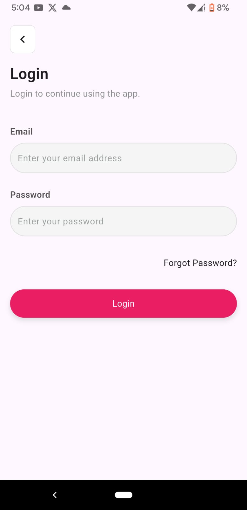

### 🔐 Register Page
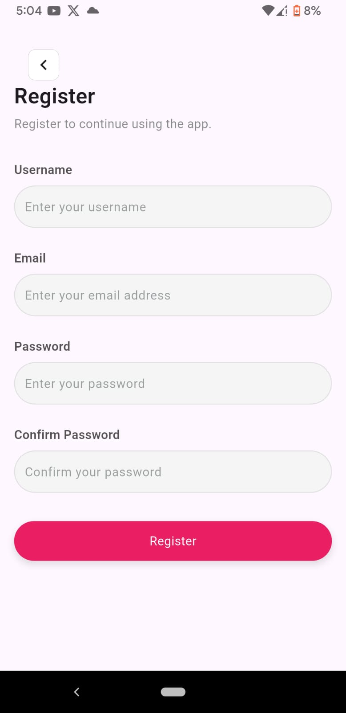

### 🔐 OTP Page (Verification)
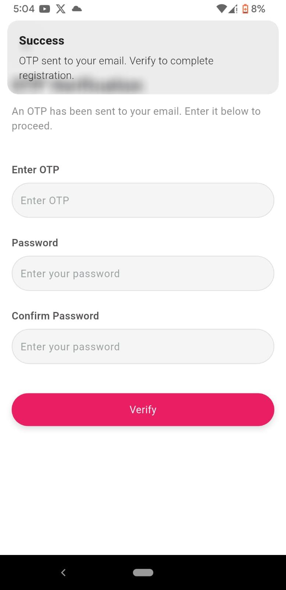

### 🔐 Home Page
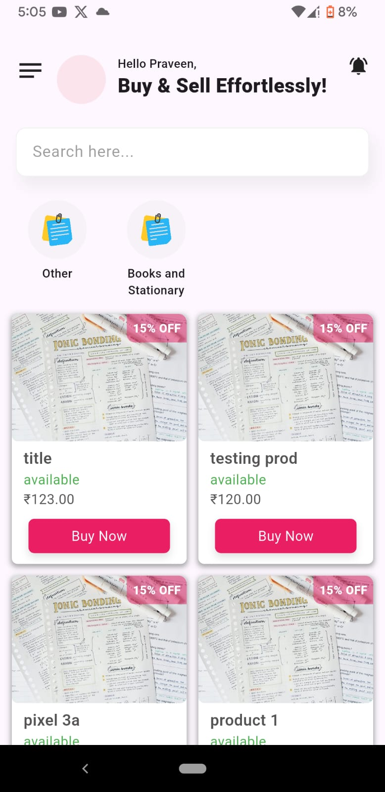

### 🔐 Product Detail Page (send request)

### 🔐 Menu 
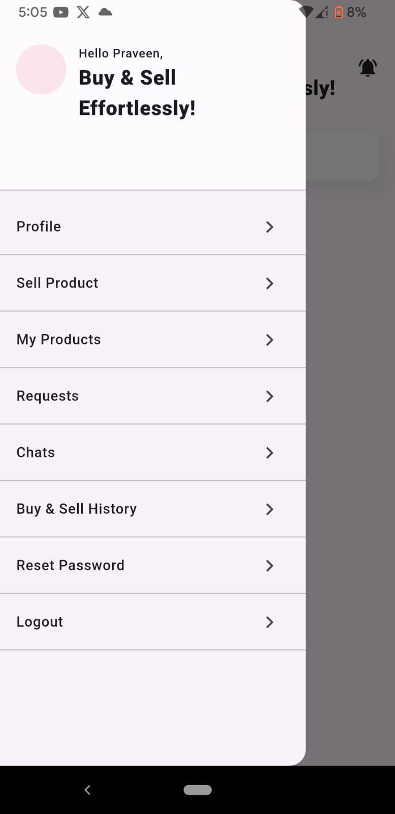

### 🔐 Profile Page

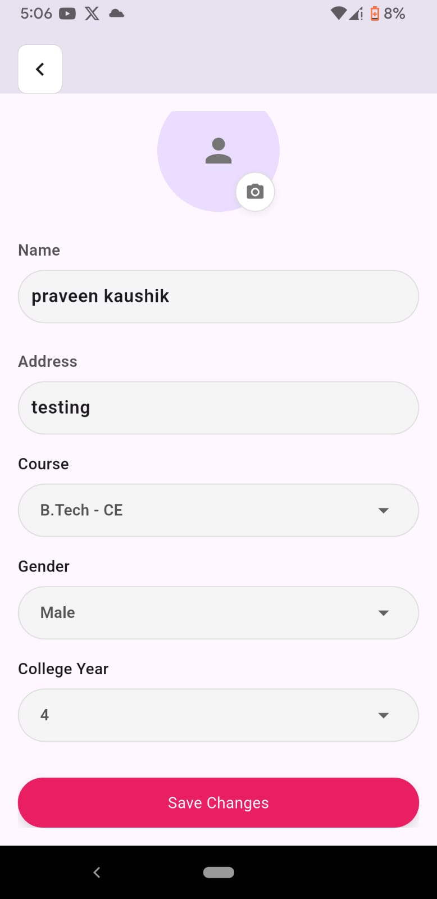

### 🔐 Create/Sell Product Page 
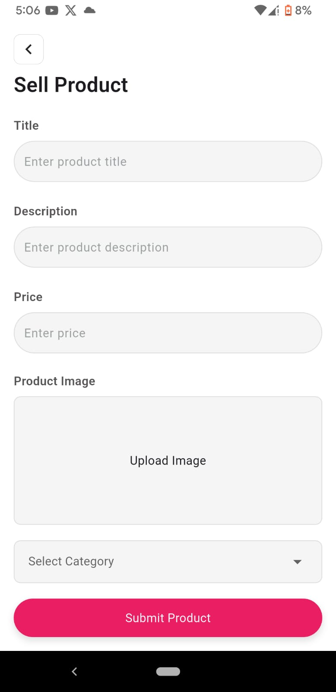

### 🔐 My Products Page 
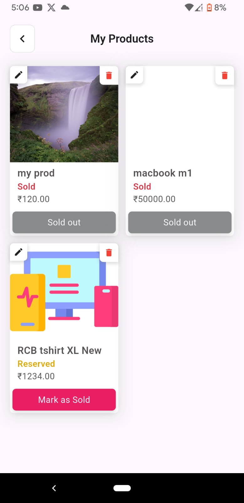

### 🔐 Manage Request Page 
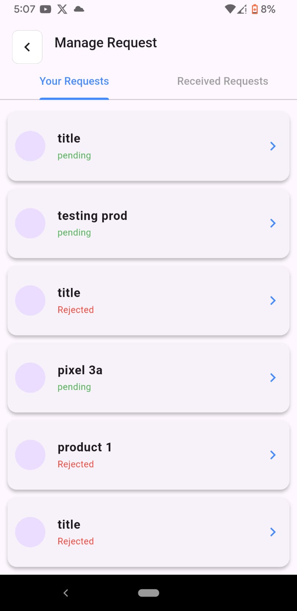
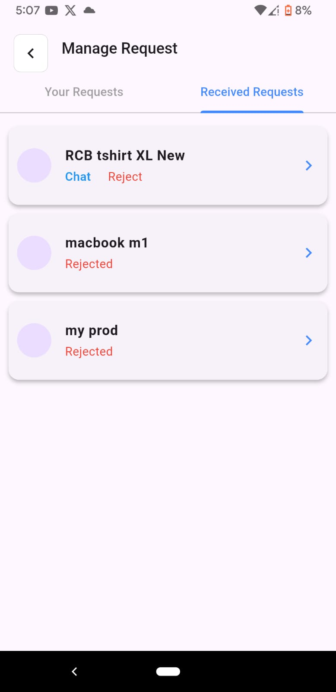

### 🔐 History Page 
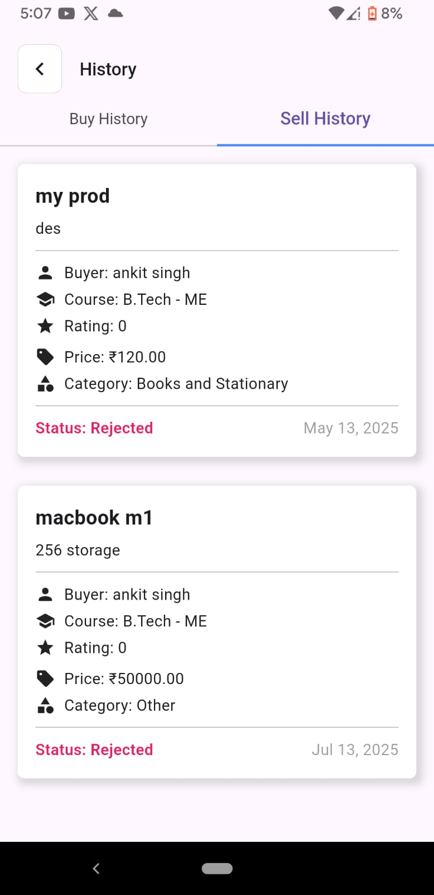

### 🔐 Chats Page 
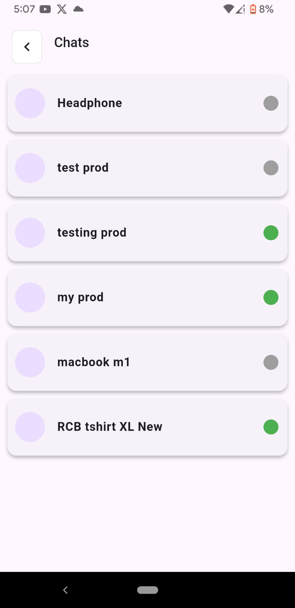
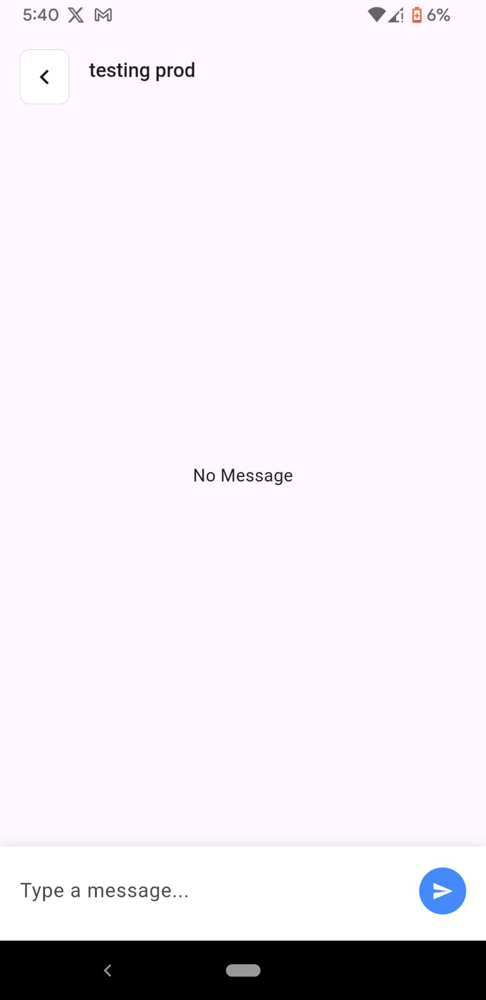

### 🔐 Reset Password Page 
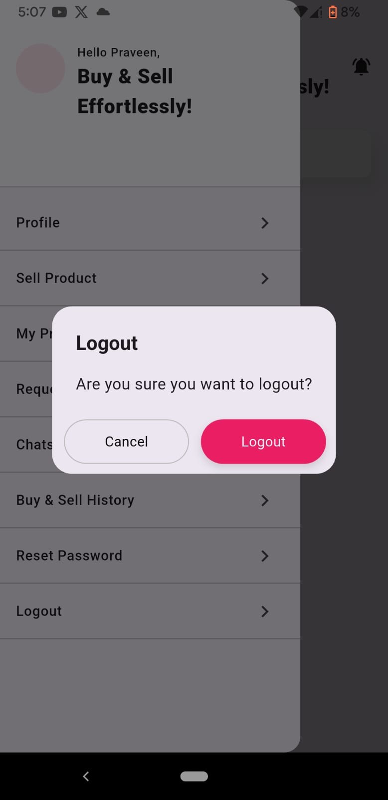

